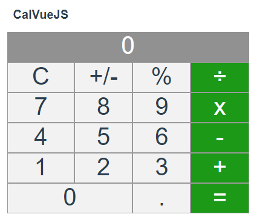

# CalVueJS

### About the CalVueJS
CalVueJS is a Simple Calculator Application was developed using VueJS. The purpose of this application is to understand how to build something using vue and if you interest to learn more about it, feel free to clone this repo and play around with it.

### Getting Started
To getting started with Application, just clone this repo by using these command :

```
git clone https://github.com/ivandi1980/calvuejs.git

```

### Install Dependencies
Before running this Application, you have to install some dependencies by using these command :

```
npm install
```

### Compiles and hot-reloads for development
These command is used to run the applicaton : 
```
npm run serve
```

### Compiles and minifies for production
if everything already ok, then you can compiles it for production using these command :

```
npm run build
```

## Screenshoot

